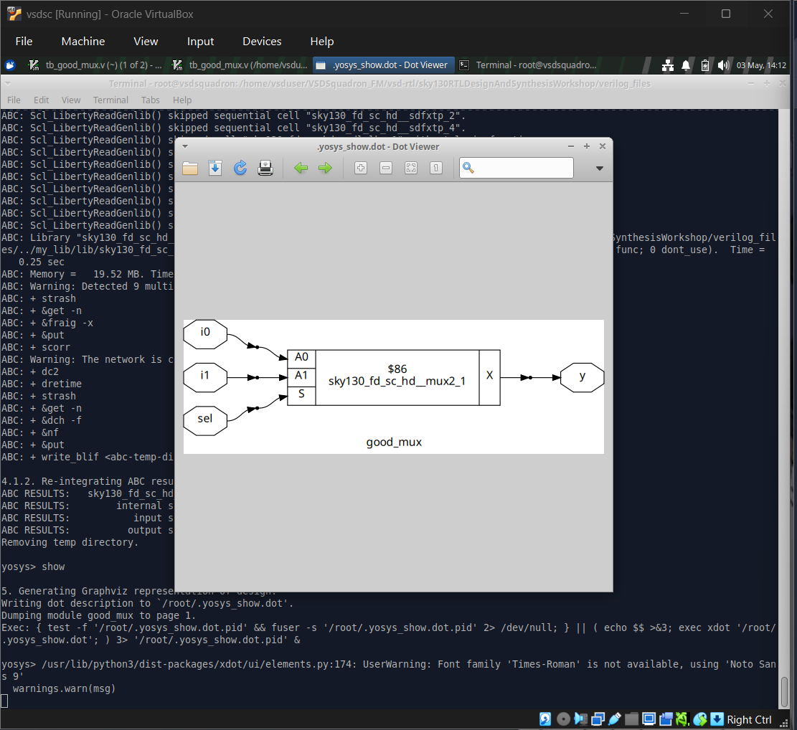
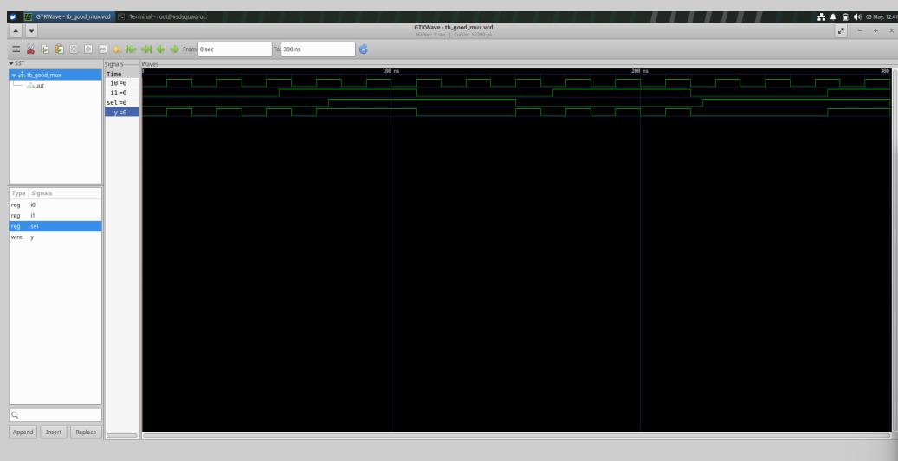
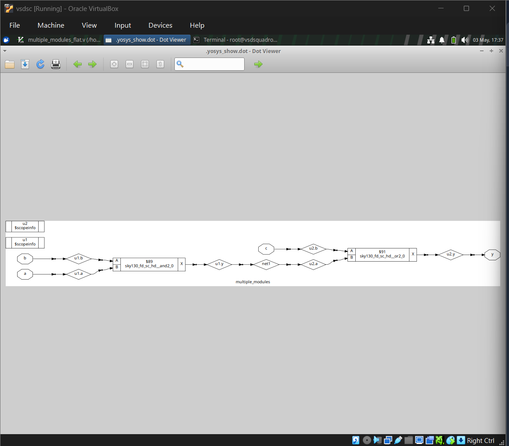
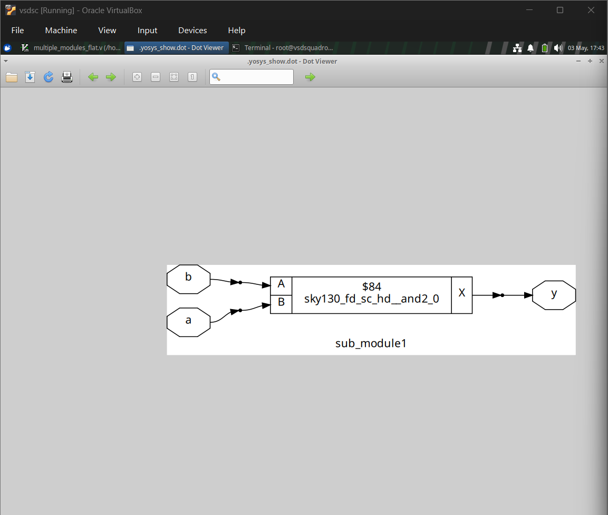
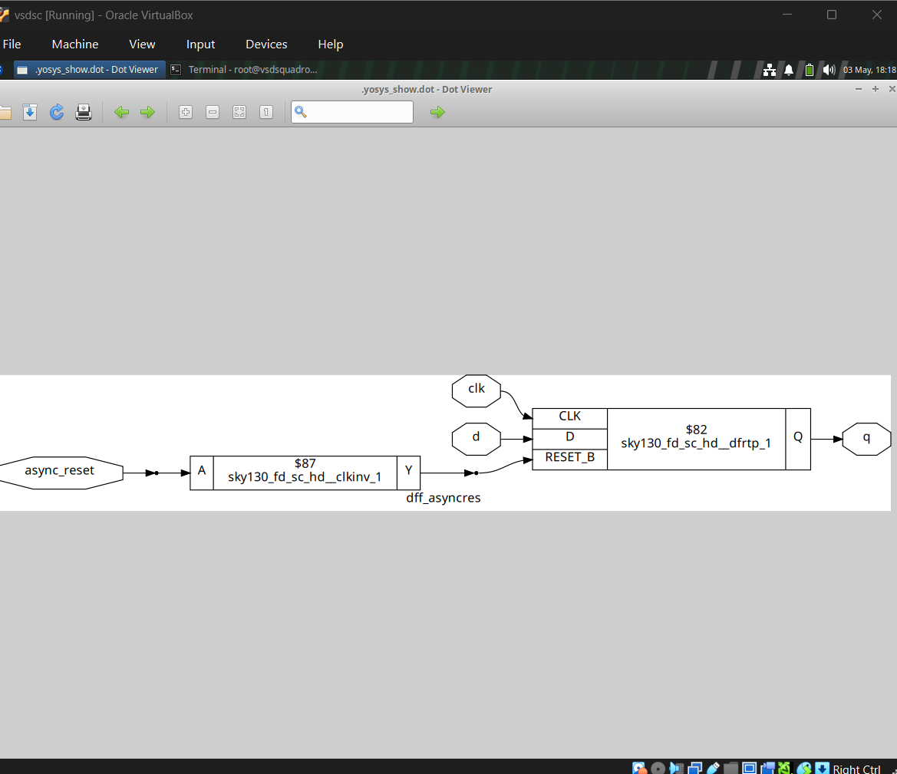
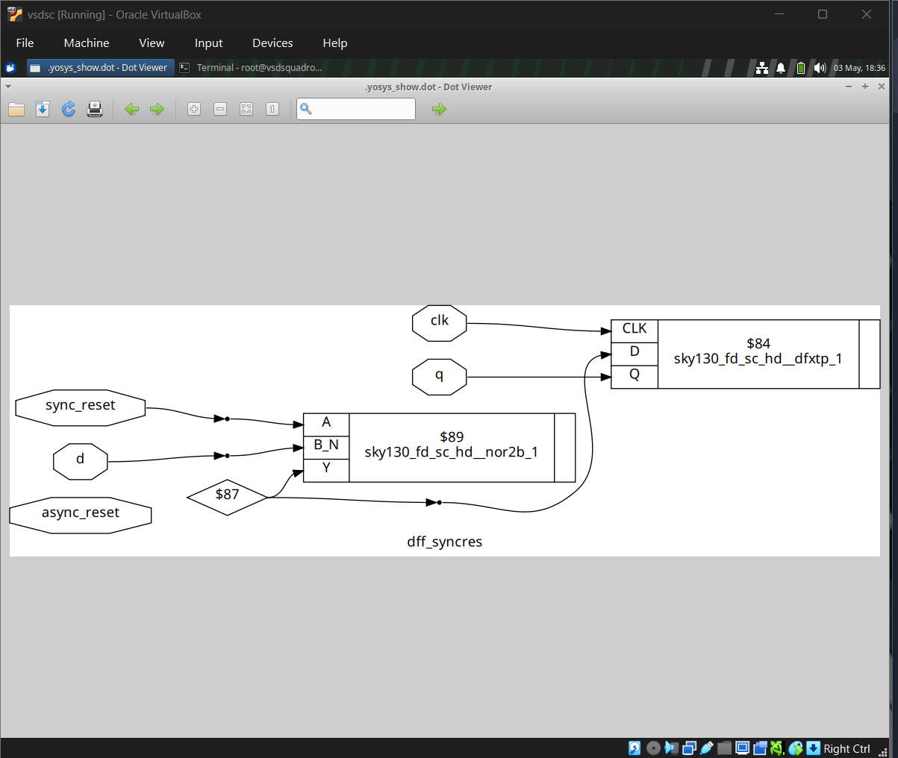
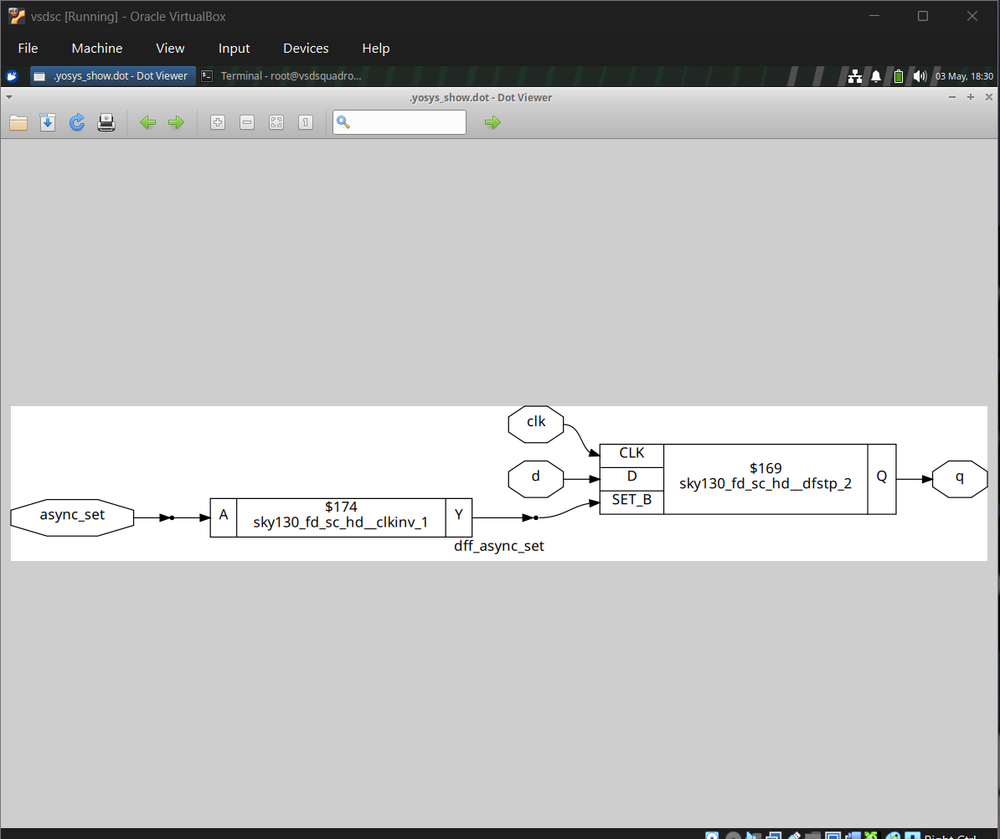
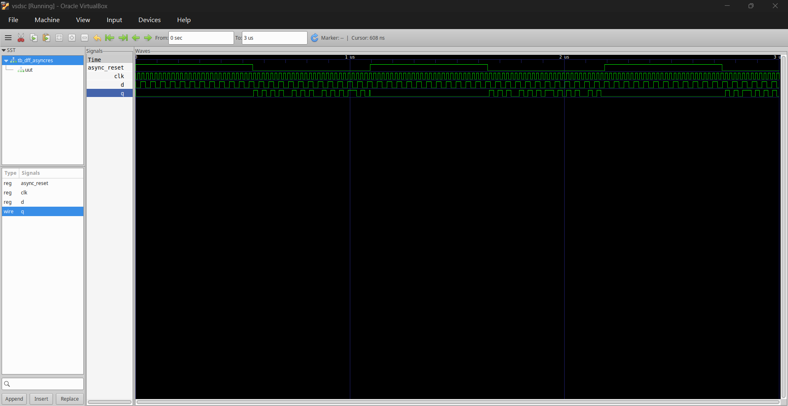
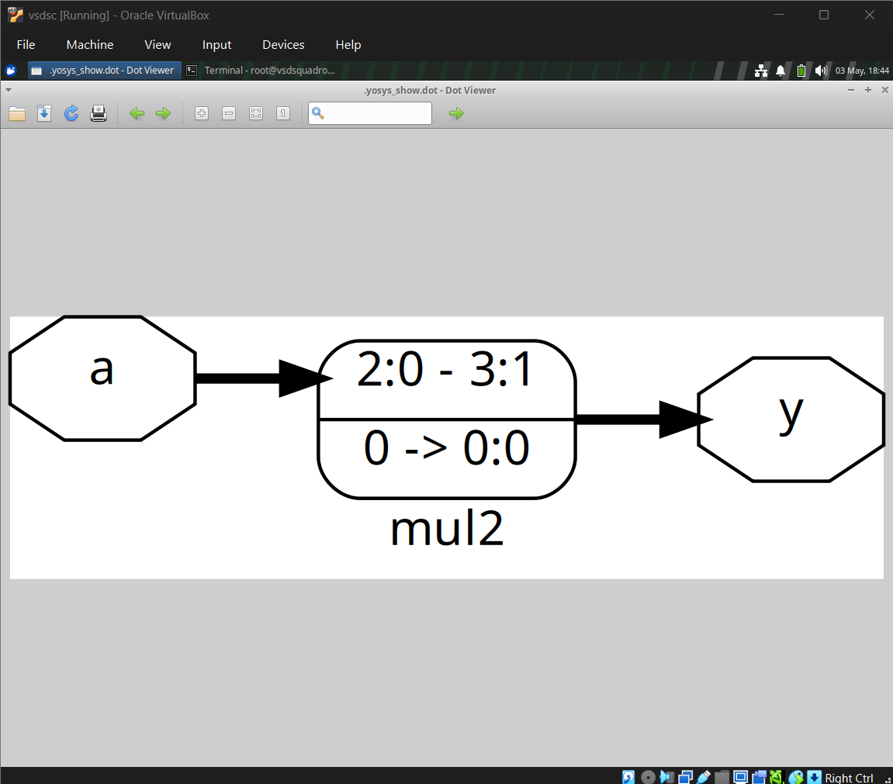
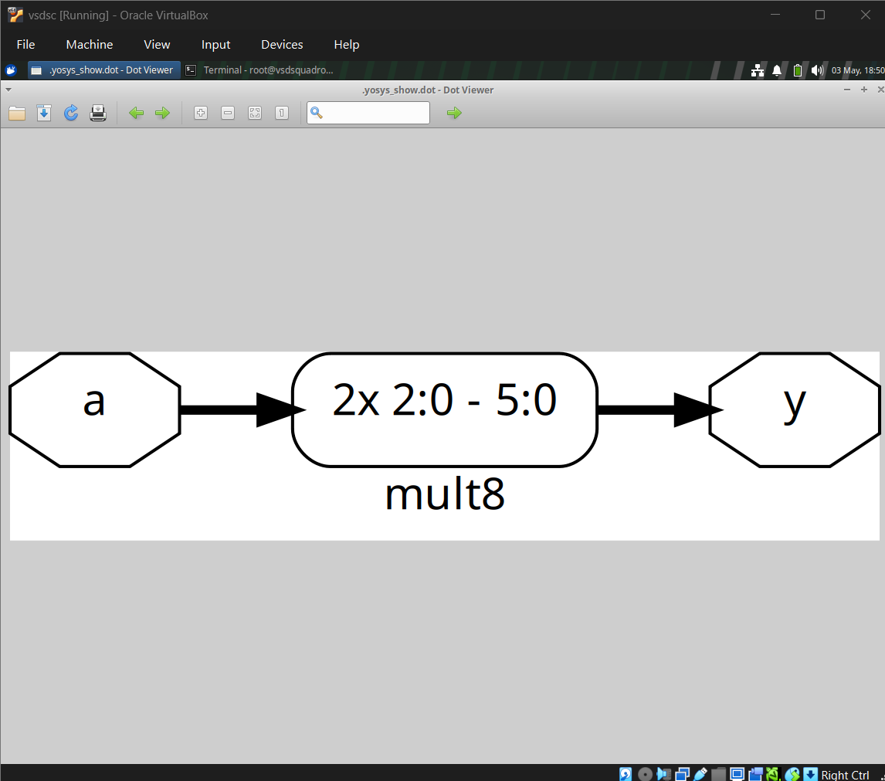

# SKY130-RTL-Design-## SKY130 RTL Design and Synthesis Workshop

## Tools Used

- Yosys – Logic synthesis
- Icarus Verilog – Simulation
- GTKWave – Waveform viewer
- Sky130 Standard Cell Library – Technology mapping
## Design Flow

RTL Design (Verilog)
        ↓
Simulation (Icarus Verilog + GTKWave)
        ↓
Synthesis (Yosys)
        ↓
Technology Mapping (Sky130 Library)
        ↓
Gate-Level Netlist + Visualization

## Key Learnings

- Difference between combinational and sequential circuits
- Importance of sensitivity list (`always @(*)`)
- Role of standard cell libraries in synthesis
- Optimization techniques (e.g., shift instead of multiplication)
- Hierarchical vs flattened design
- Asynchronous vs synchronous reset behavior
---

## 1. MUX Synthesis (good_mux)
Description:
A 2:1 multiplexer is designed and synthesized. Output y selects between i0 and i1 based on sel.
# Step 1: Compile
iverilog good_mux.v tb_good_mux.v

# Step 2: Run
./a.out

# Step 3: View waveform
gtkwave tb_good_mux.vcd

# Step 4: Start Yosys
yosys

# Step 5: Read files
read_liberty -lib sky130_fd_sc_hd__tt_025C_1v80.lib
read_verilog good_mux.v

# Step 6: Synthesize
synth -top good_mux

# Step 7: Technology mapping
abc -liberty sky130_fd_sc_hd__tt_025C_1v80.lib

# Step 8: Show schematic
show

---

## 2. Hierarchical Design – Multiple Modules
Description:
Design consists of multiple submodules connected hierarchically. Yosys flattens and synthesizes the complete design.

# Step 1: Launch Yosys
yosys

# Step 2: Load library and design
read_liberty -lib sky130_fd_sc_hd__tt_025C_1v80.lib
read_verilog multiple_modules.v

# Step 3: Synthesis
synth -top multiple_modules

# Step 4: Technology mapping
abc -liberty sky130_fd_sc_hd__tt_025C_1v80.lib

# Step 5: View schematic
show

---

## 3. Submodule Synthesis (AND Gate)
Description:
A simple submodule implementing AND logic is synthesized independently.
# Step 1: Launch Yosys
yosys

# Step 2: Load library and design
read_liberty -lib sky130_fd_sc_hd__tt_025C_1v80.lib
read_verilog sub_module.v

# Step 3: Synthesis
synth -top sub_module1

# Step 4: Technology mapping
abc -liberty sky130_fd_sc_hd__tt_025C_1v80.lib

# Step 5: View schematic
show

---

## 4. Sequential Circuit – Basic D Flip-Flop

---

## 5. Sequential Circuit – D Flip-Flop with Asynchronous Reset
Description:
D Flip-Flop resets immediately when reset signal is active, independent of clock.
# Step 1: Launch Yosys
yosys

# Step 2: Load library and design
read_liberty -lib sky130_fd_sc_hd__tt_025C_1v80.lib
read_verilog dff_asyncres.v

# Step 3: Synthesis
synth -top dff_asyncres

# Step 4: Technology mapping
abc -liberty sky130_fd_sc_hd__tt_025C_1v80.lib

# Step 5: View schematic
show

---

## 6. Sequential Circuit – D Flip-Flop with Asynchronous Set
Description:
Reset is applied only on the clock edge, not immediately.

# Step 1: Launch Yosys
yosys

# Step 2: Load library and design
read_liberty -lib sky130_fd_sc_hd__tt_025C_1v80.lib
read_verilog dff_syncres.v

# Step 3: Synthesis
synth -top dff_syncres

# Step 4: Technology mapping
abc -liberty sky130_fd_sc_hd__tt_025C_1v80.lib

# Step 5: View schematic
show

---

## 7. Sequential Circuit – Flip-Flop Implementation
Description:
Basic D Flip-Flop implemented and synthesized using standard cells.

# Step 1: Launch Yosys
yosys

# Step 2: Load library and design
read_liberty -lib sky130_fd_sc_hd__tt_025C_1v80.lib
read_verilog dff.v

# Step 3: Synthesis
synth -top dff

# Step 4: Technology mapping
abc -liberty sky130_fd_sc_hd__tt_025C_1v80.lib

# Step 5: View schematic
show

---

## 8. Optimization Case – mul2
Description:
Multiplication by 2 is optimized by shifting left (y = a << 1). No multiplier hardware needed.

# Step 1: Launch Yosys
yosys

# Step 2: Load design
read_verilog mul2.v

# Step 3: Synthesis
synth -top mul2

# Step 4: View schematic
show

---

## 9. Combinational Logic – mult8
Description:
Multiplication by 8 implemented using bit concatenation (y = {a, a}), optimized during synthesis.
# Step 1: Launch Yosys
yosys

# Step 2: Load design
read_verilog mult8.v

# Step 3: Synthesis
synth -top mult8

# Step 4: View schematic
show

## Observations

- All designs were successfully synthesized using Sky130 library
- Yosys mapped RTL to standard cells like AND, OR, DFF
- Sequential circuits resulted in flip-flop cells
- Optimization reduced hardware complexity in mul2 and mult8

  ## Conclusion

This project demonstrates the complete RTL to gate-level synthesis flow using open-source tools. It provides hands-on understanding of digital design, optimization, and real-world standard cell mapping.

## Future Scope

- Timing analysis
- FPGA implementation
- Power optimizationand-Synthesis-Workshop
